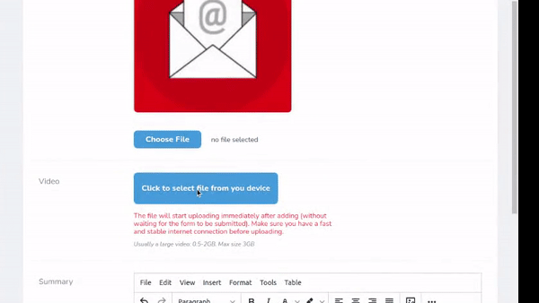

# Laravel nova "chunked-video"
A highly targeted package for downloading video in chunks.



## Versions targeting

| Package | Nova  |
|---------|-------|
| 1.x     | 3.x   |
| 2.x     | 4.x   |


## Installation

You can install the package via composer:

```bash
composer require yaroslawww/nova-chunked-video
# optional publish configs
php artisan vendor:publish --provider="ThinkOne\ChunkedVideo\FieldServiceProvider" --tag="config"
```

## Usage

```injectablephp
ChunkedVideo::make( 'Video', 'big_video' )
    ->acceptedTypes( 'video/mp4' )
    ->disk( 'my_private_disk' )
    ->store( function ( $filePath, $disk, $model, $attribute, $request ) {
        // something like delete old video and save new
        
        $model->big_video = $filePath;
        $model->save();
        
        return Storage::disk($disk)->url($filePath);
    } )
    ->preview( function ( $value, $disk, $model ) {
        // return preview url
        return Storage::disk($disk)->url($value);
    } )
    ->help( 'Usually a large video: 0.5-2GB. Max size 3GB' ),
```

## Credits

- [](https://think.studio/)
